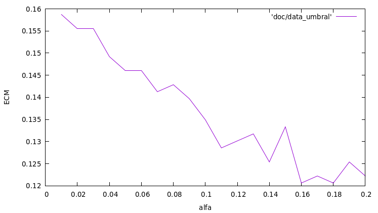
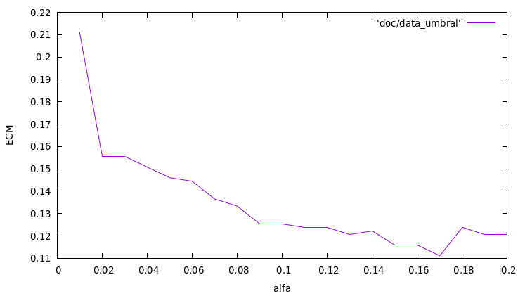
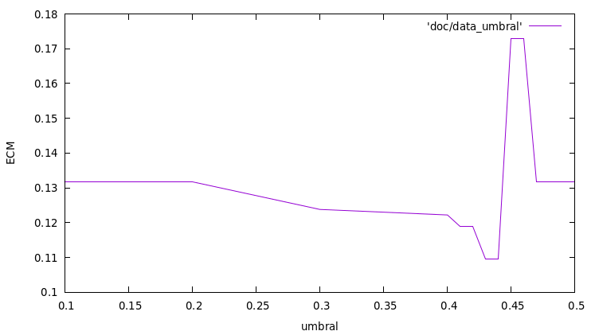
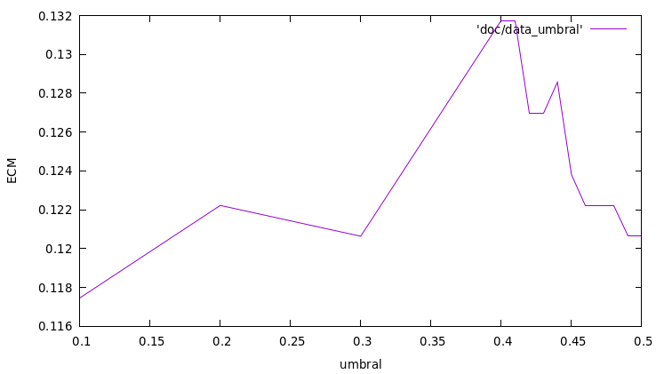

# Práctica 1
Autores: Pablo Sánchez Redondo y Antonio Solana Vera

## McCulloch-Pitts

Esta red tiene un diseño simple de tres capas, para simular el circuito lógico dado, las tres neuronas de entrada, las tres neuronas que representan las puertas AND, y la neurona de la puerta OR.


Dado que esta red no es de autoaprendizaje, conectamos las neuronas manualmente y ejecutamos el bucle (disparar &rightarrow; inicializar &rightarrow; propagar) tantas veces como entradas tengamos, y luego otras dos veces, ya que tienen que disparar y propagar la capa a y la capa y para procesar la entrada.

Respecto al diseño hemos decidido, para simular el comportamiento de la puerta AND, poner el umbral a 2, así, sólo cuando reciba un 1 de ambas conexiones se activará. La puerta OR es similar, el umbral está a 1 para que en cuanto cualquiera de las conexiones entrantes de una salida activa, se active. Por ello, los pesos de todas las conexiones es 1.

La función f(t+2) se comporta de manera que si hay al menos dos entradas activas, la salida estará activa.

## Implementación de las redes Perceptrón y Adaline

Usando las clases para redes neuronales, creadas en el primer punto de la practica, creamos dos capas, una de entrada y una de salida.

### AND
Perceptrón:
```
2 * x_1 + 3 * x_2 - 4 = 0
```

Adaline:
```
3 * x_1 + 4 * x_2 - 6 = 0
```

### OR
Perceptrón:
```
2 * x_1 + 2 * x_2 - 1 = 0
```

Adaline:
```
2 * x_1 + 2 * x_2 - 1 = 0
```

### NAND
Perceptrón:
```
-2 * x_1 - 3 * x_2 + 4 = 0
```

Adaline:
```
-3 * x_1 - 4 * x_2 + 6 = 0
```

### XOR
Ni el perceptrón ni adaline han conseguido resolver este problema con dos capas.
Esto es por que XOR no es linearmente separable a diferencia de las otras puertas lógicas.

## Problema real 1
La red neuronal consta de
    - Dos capas.
    - 9 neuronas de entrada.
    - 2 neuronas de salida.

Cambio de alfa en el perceptrón:


Cambio de alfa en el adaline:


Cambio de umbral en el perceptrón:


Cambio de umbral en el adaline:


Se puede observar claramente que el error cuadrático disminuye al usar adaline.

## Problema real 2
A pesar de haber variado mucho todos los metaparámetros de ambas redes neuronales, no hemos conseguido que el perceptrón ni adaline converjan. No estamos seguros de si es un problema de expresividad de la propia red (una falta de capas por ejemplo) o si es problema de nuestra implementación.
